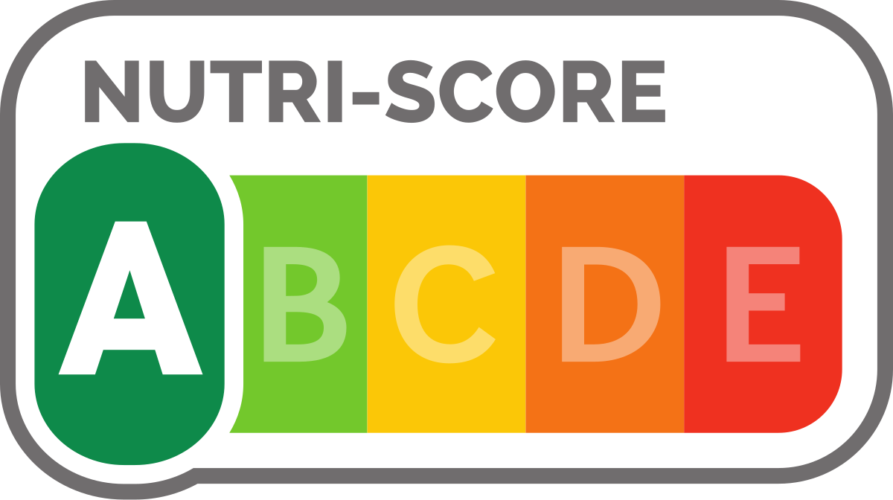
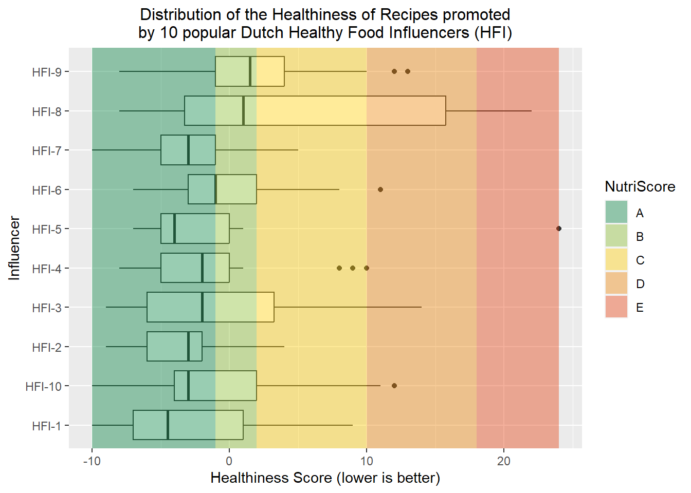

<!-- Improved compatibility of back to top link: See: https://github.com/othneildrew/Best-README-Template/pull/73 -->
<a name="readme-top"></a>
<!--
*** Thanks for checking out the Best-README-Template. If you have a suggestion
*** that would make this better, please fork the repo and create a pull request
*** or simply open an issue with the tag "enhancement".
*** Don't forget to give the project a star!
*** Thanks again! Now go create something AMAZING! :D
-->


<!-- PROJECT SHIELDS -->
<!--
*** I'm using markdown "reference style" links for readability.
*** Reference links are enclosed in brackets [ ] instead of parentheses ( ).
*** See the bottom of this document for the declaration of the reference variables
*** for contributors-url, forks-url, etc. This is an optional, concise syntax you may use.
*** https://www.markdownguide.org/basic-syntax/#reference-style-links
-->

<!-- PROJECT LOGO -->
<br />
<div align="center">
  <a href="https://https://github.com/wvanelteren/recipe-healthiness-analyser">
    
  </a>

<h3 align="center">Recipe Healthiness Analyser</h3>

  <p align="center">
    Calculate the nutrition per 100g and NutriScore of a Recipe!
    <br />
    <a href="https://wvanelteren.github.io/recipe-healthiness-analyser/recipe_analysis_report.html"><strong>Explore a usecase here</strong></a>
  </p>
</div>

<!-- ABOUT THE PROJECT -->
## About The Project

The recipe healthiness analyser takes as input a recipe title, ingredient list and amount of intended servings and outputs the following nutrients per 100g:
* energy (Kj)
* sugar (g)
* saturated fat (g)
* sodium (mg)
* protein (g)
* fiber (g)
* proportion that is either fruit, vegetable or nuts (%)

To objectively determine the healthiness of a recipe, it also outputs a recipe's:
* [healthiness score (FSAm-NPS DI)](https://www.ncbi.nlm.nih.gov/pmc/articles/PMC6143197/)
* [NutriScore](https://www.iarc.who.int/wp-content/uploads/2021/09/IARC_Evidence_Summary_Brief_2.pdf)

This project was created as part of my bachelor thesis. In my bachelor thesis, I analysed the recipes of popular Dutch Healhty Food Influencers on Instagram. You can find an analysis report here: [https://wvanelteren.github.io/recipe-healthiness-analyser/recipe_analysis_report.html](https://wvanelteren.github.io/recipe-healthiness-analyser/recipe_analysis_report.html)



<p align="right">(<a href="#readme-top">back to top</a>)</p>

### Prerequisites

In its current form, the recipe healthines analyser requires a Spoonacular API key. A free api key can be found [here](https://spoonacular.com/food-api). **take note:** Spoonacular doesn NOT allow caching of its results. I have had a written one time permission to store their data for my bachelor thesis. Therefore, **do not cache any data**.

### Installation

1. Clone the repo
   ```sh
   git clone https://github.com/wvanelteren/recipe-healthiness-analyser.git
   ```
3. Install requirements
   ```sh
   poetry install
   ```
4. Enter your API key in recipe_healthiness_analyser/recipe_analyser/nutrition/constants/api_requests.py
   ```py
   const SPOONACULAR_API_KEY = 'ENTER YOUR API';
   ```
5. edit main.py to your liking

<p align="right">(<a href="#readme-top">back to top</a>)</p>


<!-- ROADMAP -->
## Roadmap

In the future (possibly for my Master Thesis), Spoonacular api will be swapped out for a machine learning solution of my own.

<p align="right">(<a href="#readme-top">back to top</a>)</p>


<!-- CONTRIBUTING -->
## Contributing

Contributions are what make the open source community such an amazing place to learn, inspire, and create. Any contributions you make are **greatly appreciated**.

If you have a suggestion that would make this better, please fork the repo and create a pull request. You can also simply open an issue with the tag "enhancement".
Don't forget to give the project a star! Thanks again!

1. Fork the Project
2. Create your Feature Branch (`git checkout -b feature/AmazingFeature`)
3. Commit your Changes (`git commit -m 'Add some AmazingFeature'`)
4. Push to the Branch (`git push origin feature/AmazingFeature`)
5. Open a Pull Request

<p align="right">(<a href="#readme-top">back to top</a>)</p>

<!-- LICENSE -->
## License

Distributed under the MIT License. See `LICENSE.txt` for more information.

<p align="right">(<a href="#readme-top">back to top</a>)</p>