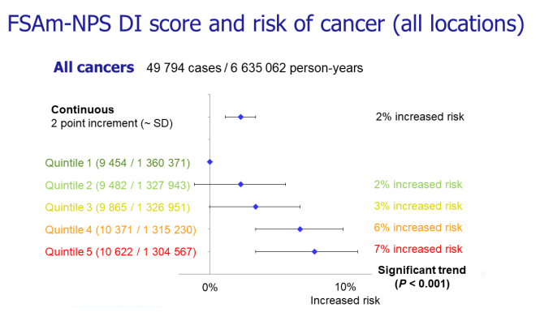

# Analysis of Recipes of Dutch Healthy Food Influencers on Instagram

As part of my bachelor thesis, I analysed the recipes promoted by Dutch Healthy Food Influencers on Instagram. Healthy food influencers (i.e. social media influencers that whose main content is healthy food) have seen a sharp rise in popularity due to the corona pandemic and "healthy lifestyle" trend. However, Dutch nutritionists are concerned about the influence healthy food influencers may have on their audience's meal choice and may even be forming a risk to public health (Diëtisten verontust, 2021). They state that most Dutch healthy food influencers started as hobby cooks and are not certified dieticians or nutritionists and therefore should not be in a position to advise on healthy eating. This begs the question: how healthy are their recipes?

Additionally, my thesis examined the effect of the healthiness of a recipe on the amount of social media engagement (in the form of likes and comments) it received.

## Data Collection

### Healthy Food Influencer Sample

Healthy food influencers were selected by monitoring the "Top Posts" section of the "#gezondenrecpten" and "#gezondeten" hashtags on Instagram daily for a period of one month. Those who made the top posts section more than three times during that month were selected. This resulted in a sample of 19 healthy food influencers. The Instagram posts of each healthy food influencer of last month were subsequently examined. Influencers were removed if they did not provide an ingredient list for their recipes, since an ingredient list is required for the analysis, or if they were not of Dutch nationality. Additionally, an arbitrary threshold was set of 10.000 followers as a requirement for inclusion.

These exclusion criteria resulted in a final sample of 10 Dutch healthy food influencers. As an ethical consideration, the names of the healthy food influencer were made secret.

### "Healthy" Recipe Sample

Since influencers become more popular the more followers they have, which results in more likes and comments, only the recipes of the last four months (14 June 2022 -- 14 March 2022) were cross-sectionally manually scraped. This resulted in a sample of 257 recipes. This sample was later further reduced to 248 recipes based on exclusion criteria as stated in appendix B. The id, ingredient list, number of likes, number of comments, and the post type (i.e. video or picture) of the healthy recipe sample was collected and stored in a CSV file.

## Operationalising Variables

### Healthiness

The explanatory variable in this study's design is the healthiness of a recipe depicted in a healthy food influencer's Instagram post. The healthiness was determined via the NutriScore nutrient profile model. This model calculates a healthiness score (lower is healthier) for a recipe based on its calorie, saturated fat, sodium, protein, fibre, and vegetables, nuts, fruits content per 100g. In this study, the healthiness of a recipe is determined by the healthiness score. The NutriScore model gives meaning to the healthiness score by assigning a corresponding label named the NutriScore. The NutriScore goes from A (most healthy) to E (least healthy). The recommendations for the implementation of the NutriScore model state that public health initiatives should encourage the consumption of foods that receive a Nutri-Score of either A or B, while the consumption of foods that receive a Nutri-Score of D or E should be limited (Federale Overheidsdienst Volksgezondheid, Veiligheid van de Voedselketen en Leefmilieu, 2022).

The NutriScore is based on the following table:

| Healthiness Score | NutriScore |
|-------------------|------------|
| \<-1              | A          |
| 0 - 2             | B          |
| 3 - 10            | C          |
| 11 - 18           | D          |
| \>19              | E          |

The meaning of the NutriScore finds itself in cancer research. A diet that mainly consist of food from a specific NutriScore has a corresponding increased risk of cancer. See the image below where Q1 corresponds to A, Q2 to B, ... , Q5 to E



The NutriScore model was chosen for three reasons:

1.  It is most relevant to the study, as NutriScore is adopted in the Netherlands and the sample consists of content from Dutch food influencers

2.  Studies that compared European nutrient profiling models found NutriScore to be the most accurate for establishing objective healthiness

3.  NutriScore translates to real-world effects (e.g. increased risk of cancer).

Both the healthiness score and NutriScore were obtained via the [recipe_healthiness_analyser](.../recipe_healthiness_analyser/) python program.

## Exploratory Data Analysis

### Load data and descriptive stats

```{r load data}
library(readr)

# Load recipes, drop unnecessary columns
recipes <- read_csv("analysed_recipes.csv")
recipes <- recipes[-c(1, 3, 4, 8:16)]

# Set variables
author <- recipes$author
likes <- recipes$likes
comments <- recipes$comments
media <- recipes$media
healthiness_score <- recipes$healthiness_score
nutri_score <- recipes$nutri_score
```

```{r}
head(recipes)
```

Let's check the descriptive statistics

```{r}
summary(recipes)
```

Let's also check for missing values, since no one should trust their own programs :)

```{r}
colSums(is.na(recipes))
```

Looks good.

Let's see how many recipes each influencer has in the sample.

```{r}
library(dplyr)
recipes %>%
  group_by(author) %>%
  summarise(cnt = n())
```

### Distribution of the healthiness Recipes

Let's focus on the NutriScore for now. If we want to see how healthy the recipes are, and to what extent Dutch healthy food influencers contribute to increased cancer risk, we have to focus on its distribution.

```{r}
# NutriScore
recipes %>%
  group_by(nutri_score) %>%
  summarise(cnt = n()) %>%
  mutate(freq = round(cnt / sum(cnt), 3)) %>%
  arrange(desc(freq))

```

Let's see how the distribution per influencer is

```{r}
recipes %>%
  group_by(nutri_score, author) %>%
  summarise(cnt = n()) %>%
  mutate(freq = round(cnt / sum(cnt), 3)) %>%
  arrange(desc(freq))
```

Okay that may be a little hard to see. Instead, lets visualize that distribution.

```{r}
# colours of NutriScore
Ac <- "#00823F"
Bc <- "#86BC2B"
Cc <- "#FECC00"
Dc <- "#EE8200"
Ec <- "#E73C09"

nutri_colours <- c(Ac, Bc, Cc, Dc, Ec)

# Nutriscore bounds
lower_bounds <- c(-10, -1, 2, 10, 18)
upper_bounds <- c(-1, 2, 10, 18, 24)

# Rectangles that annotate the background of the plot
rects <- data.frame(
  start = lower_bounds,
  end = upper_bounds,
  fill = factor(1:5)
)

ggplot() +
  geom_boxplot(
    data = recipes,
    aes(x = author,
        y = healthiness_score)
  ) +
  geom_rect(
    data = rects,
    aes(ymin = start,
        ymax = end,
        fill = fill),
    xmin = -Inf,
    xmax = Inf,
    alpha = 0.4
  ) +
  scale_fill_manual(
    name = "NutriScore",
    labels = c("A", "B", "C", "D", "E"),
    values = nutri_colours
  ) +
  labs(x = "Influencer", y = "Healthiness Score (lower is better)") +
  coord_flip()
```
